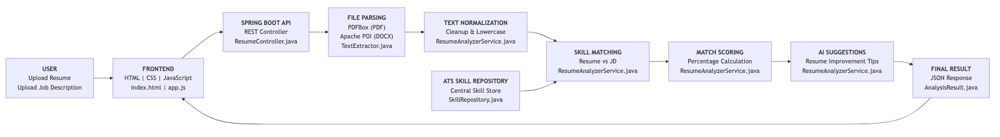
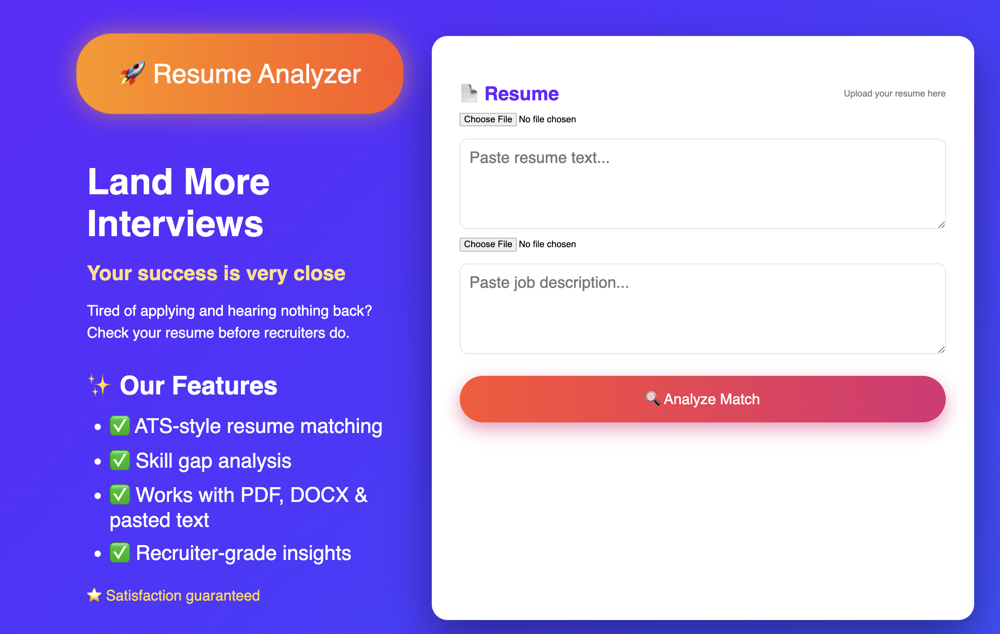
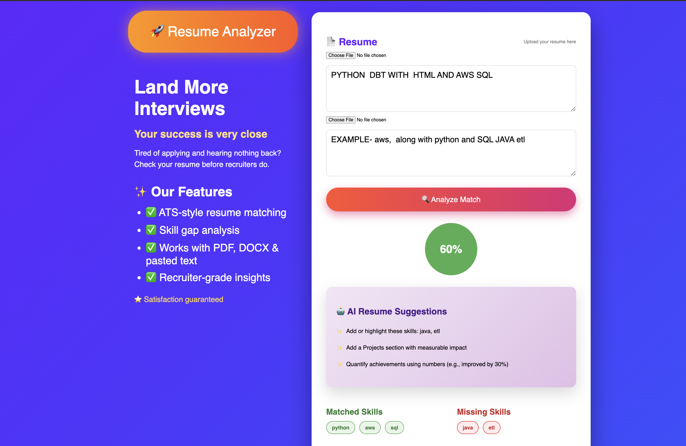
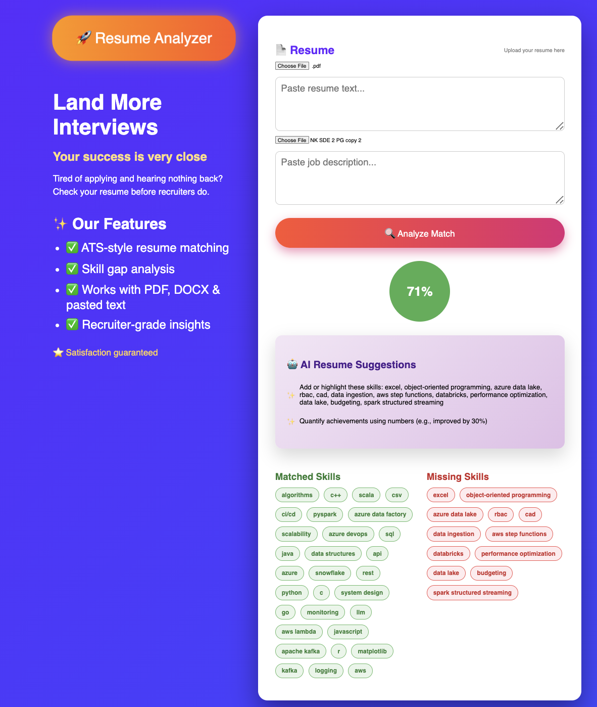

<h1 align="center">🚀 Resume Analyzer (ATS-Style)</h1>

<p align="center">
<b>
A full-stack ATS-style Resume Analyzer that compares resumes with job descriptions, calculates match percentage, highlights missing skills, and provides AI-style improvement suggestions.
</b>
</p>

<p align="center">
<b>Spring Boot • Java • JavaScript • Apache PDFBox • Apache POI</b>
</p>

---

## 📘 **PROJECT OVERVIEW**
---

Modern companies rely on **Applicant Tracking Systems (ATS)** to filter resumes before a human recruiter ever reviews them. These systems primarily use keyword matching, skill alignment, and formatting rules, often rejecting qualified candidates without providing any feedback.

This project simulates **real-world ATS screening behavior** by analyzing resumes against job descriptions. It extracts and normalizes resume content, compares skills using an ATS-style repository, calculates a match percentage, identifies missing skills, and generates **AI-style resume improvement suggestions**—helping candidates understand ATS decisions and optimize their resumes before applying.

---

## ⭐ **FEATURES**
---

<table width="100%">
<tr>
<td width="33%" align="center" valign="top">

### 📄 **ATS Resume Matching**
Resume vs Job Description  
Keyword-based evaluation  
Real ATS-style logic  

</td>
<td width="33%" align="center" valign="top">

### 🔍 **Skill Gap Analysis**
Matched skills  
Missing skills  
Clear visual feedback  

</td>
<td width="33%" align="center" valign="top">

### 📁 **Multi-Format Support**
PDF resumes  
DOCX resumes  
Pasted text input  

</td>
</tr>

<tr>
<td width="33%" align="center" valign="top">

### 🤖 **AI Resume Suggestions**
Improvement tips  
Skill highlighting  
Recruiter-style feedback  

</td>
<td width="33%" align="center" valign="top">

### 📊 **Match Percentage Scoring**
ATS-style scoring  
Quick evaluation  
Easy comparison  

</td>
<td width="33%" align="center" valign="top">

### 🎯 **Transparent ATS Insights**
No black-box decisions  
Explainable results  
Real screening behavior  

</td>
</tr>
</table>

---

## 🛠️ **TECH STACK**

<table width="100%" align="center"> <tr> <td width="33%" valign="top" align="center">
🔧<h2>BACKEND</h2> 

<b><i>Business logic, ATS processing, APIs</i></b>

<ul align="left"> <li><b>Java 17</b></li> <li><b>Spring Boot</b></li> <li><b>REST APIs</b></li> <li><b>Apache PDFBox</b> (PDF parsing)</li> <li><b>Apache POI</b> (DOCX parsing)</li> <li><b>Maven</b></li> </ul> </td> <td width="33%" valign="top" align="center">
🎨 <h2>FRONTEND</h2>

<b><i>User interface & client-side logic</i></b>

<ul align="left"> <li><b>HTML</b></li> <li><b>CSS</b></li> <li><b>JavaScript</b></li> <li><b>Fetch API</b></li> </ul> </td> <td width="33%" valign="top" align="center">
🧰<H2>TOOLS & UTILITIES</H2> 

<b><i>Development, testing & configuration</i></b>

<ul align="left"> <li><b>Git & GitHub</b></li> <li><b>Postman</b></li> <li><b>VS Code / IntelliJ</b></li> <li><b>application.properties</b></li> <li><b>pom.xml</b></li> </ul> </td> </tr> </table>

---
## 🏗️ **SYSTEM ARCHITECTURE**
---

<p align="center">
  
</p>


<p align="center">
<i>
End-to-end ATS workflow showing resume upload, document parsing, text normalization, skill matching, scoring, AI suggestions, and frontend rendering.
</i>
</p>

-----


## 🖥️ **FRONTEND SCREENS & USER EXPERIENCE**
---


<table width="100%"> <tr> <td width="33%" align="center" valign="top">
<h3>🌐 Main Web Interface</h3>
 <p> <i> Primary landing page where users upload resumes, paste job descriptions, and start ATS-style analysis instantly. </i> </p> </td> <td width="33%" align="center" valign="top">
<h3>📊 ATS Match Results</h3>
 <p> <i> Displays match percentage, skill alignment, and AI-powered resume improvement suggestions in a recruiter-friendly format. </i> </p> </td> <td width="33%" align="center" valign="top">
<h3>📄 PDF & DOCX Parsing</h3>
 <p> <i> Demonstrates real resume parsing from PDF and DOCX files using Apache PDFBox and Apache POI. </i> </p> </td> </tr> </table>

-----------------

**<h2>🧾 SUMMARY </h2>**

Resume Analyzer (ATS-Style) is a **full-stack** application that simulates how real Applicant Tracking Systems evaluate resumes. The system **parses** resumes in PDF, DOCX, or text format, compares skills against job descriptions, calculates match percentage, identifies skill gaps, and **generates AI-style** resume **improvement** suggestions. A clean, user-friendly **frontend**presents results clearly, helping candidates understand ATS decisions and **optimize** resumes for better screening outcomes.

-------------

<h3>📂 PROJECT STRUCTURE</h3>

```
RESUME-ANALYZER/
├── src/
│   ├── main/
│   │   ├── java/com/yourpackage/resumeanalyzer/
│   │   │   ├── controller/
│   │   │   │   ├── HomeController.java
│   │   │   │   └── ResumeController.java
│   │   │   ├── service/
│   │   │   │   ├── ResumeAnalyzerService.java
│   │   │   │   ├── TextExtractor.java
│   │   │   │   └── SkillRepository.java
│   │   │   ├── model/
│   │   │   │   └── AnalysisResult.java
│   │   │   └── ResumeAnalyzerApplication.java
│   │   └── resources/
│   │       ├── static/
│   │       │   ├── index.html
│   │       │   ├── app.js
│   │       │   └── styles.css
│   │       └── application.properties
│   └── test/
│       └── java/com/yourpackage/resumeanalyzer/
├── img/
│   ├── architecture.png
│   ├── webpage.png
│   ├── text_example.png
│   └── pdf_example.png
├── pom.xml
├── mvnw
└── README.md
```
--------

<H2>🛠️ RUNNING LOCALLY</H2>

**1️⃣ Clone the Repository**
```
git clone https://github.com/Niroj7/RESUME-ANALYZER.git
cd RESUME-ANALYZER
```
**2️⃣ Prerequisites**
---------

**Ensure the following are installed on your system**

**1.** **_Java 17 or higher_**

**2.** **_Maven_**

**3.** **_Git_**
```
java -version
mvn -version
```
-----------
**3️⃣ Build the Application**

```
mvn clean install
```
**4️⃣ Run the Spring Boot Application**
```
mvn spring-boot:run
```
**5️⃣ Access the Application**
----------

**_Backend API runs at:_**
```
 http://localhost:8081
```
**Open the frontend by visiting:**
```
http://localhost:8081/index.html
```
--------

**✨ Happy learning and exploring — thanks for visiting this project! 🚀**

